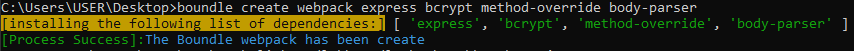
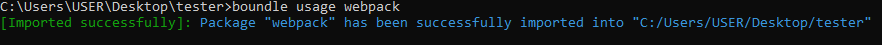
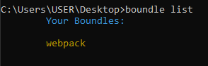
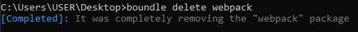
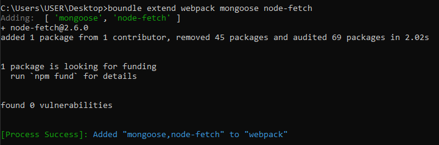
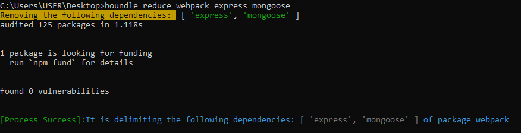
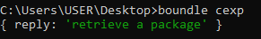
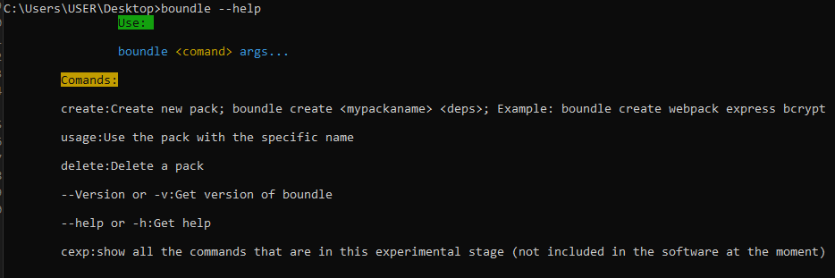

# Boundle
<div align="center">
    
</div>

[](Coverage)
[](Version)
[](Dependencis)
[](Status)
<br>
<br>

## What is boundle?

Boundle is a tool designed to create custom packages, with the modules that you want to install, there are no limits, the advantage that boundle gives you is that when you already have that package with dependencies inside you do not have to reinstall the dependencies, you can simply reuse that package with those dependencies calling them, we better go with practice.

---
## Install
You need to install boundle globally.
```js
npm i -g boundle-net
```

### Ready...

---

## How to use
To use boundle first there will be a terminal in your project directory.

## Commands

- <h2>create</h2> 
This command is used to create a new package with the dependencies that you want.<br>
`` Well, with this we would already have a package and its dependencies.``  <br>
`Example:` boundle create <strong>"pkgName"</strong> dependencies...
```cmd
C:\Users\USER\Desktop>boundle create webpack express method-override bcrypt body-parser 
```


- <h2>usage</h2>
To use this command first go to the directory where you want the package to be copied, then run it like this. <br>
`Example:` boundle usage <strong>"pkgName"</strong>
```cmd
C:\Users\USER\Desktop\tester>boundle usage webpack
```



- <h2>list</h2>
The list command outputs the list of all the packages you have created. <br>
`Example:` boundle list
```cmd
C:\Users\USER\Desktop>boundle list
```


- <h2>delete</h2>
The delete command deletes a package with the specific name passed to it by parameter. <br>
`Example:` boundle delete <strong>"pkgName"</strong>
```cmd
C:\Users\USER\Desktop>boundle delete webpack
```


- <h2>extend</h2>
This command is used to add more dependencies to an already created package. <br>
`Example:` boundle extend <strong>"pkgName"</strong> dependencies...
```cmd
C:\Users\USER\Desktop>boundle extend webpack mongoose node-fetch
```


- <h2>reduce</h2>
The reduce command is used for when we want to uninstall a dependency from our package.<br>
`Example:` boundle reduce <strong>"namePkg"</strong> dependencies...
```cmd
C:\Users\USER\Desktop>boundle reduce webpack express mongoose
```


---

## Other Commands

- <h2>cexp</h2>
This command removes all the commands that are in experimental version. <br>
`Example:` boundle cexp
```cmd
C:\Users\USER\Desktop>boundle cexp
```


- <h2>--version</h2>
This command brings out the latest version of boundle.<br>
`Example:` boundle --version | -v
```cmd
C:\Users\USER\Desktop>boundle --version
or
C:\Users\USER\Desktop>boundle -v
> output
Boundle V1.0.0
```

- <h2>--help</h2>
The --help command as its name says gives you a help to guide you. <br>
`Example:` boundle --help | -h
```cmd
C:\Users\USER\Desktop>boundle --help
or
C:\Users\USER\Desktop>boundle -h
```


---

Developer: ly-dev12
<br>
Repository: https://github.com/ly-dev12/boundle
<br>
Npm: https://www.npmjs.com/package/boundles

---

### Contributing

contributions are welcome, create a pull request and send us your feature, first check the [CONTRIBUTING GUIDELINES](CONTRIBUTING.md).

### [LICENSE MIT](https://opensource.org/licenses/MIT)

<div align="center">

<div>